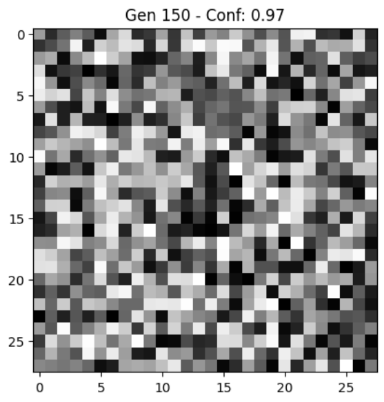
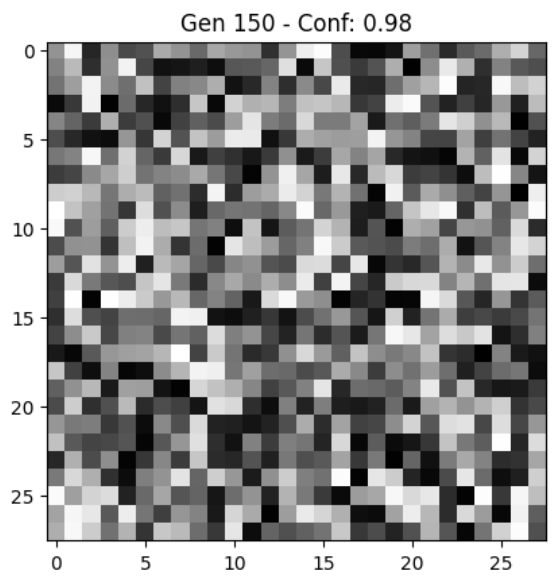

# Adversarial Attack on CNN (MNIST)

This project demonstrates how Convolutional Neural Networks (CNNs) can be fooled using evolutionary algorithms to generate images that are completely unrecognizable to humans, but are classified by the network with high confidence.

We apply a simple **direct encoding attack** on a CNN trained on the MNIST dataset. The algorithm evolves random pixel images until they are confidently classified as a specific target digit.

## Why It Matters

CNNs are powerful at recognizing patterns in data—but they don’t “see” like humans do. Instead, they respond to statistical features, edges, textures, and patterns, not actual meaning or semantics.

### 🤔 Human vs CNN

A human looks at an image and tries to understand **what it is**.

A CNN looks at an image and checks **what it statistically resembles** based on the data it was trained on.

This can lead to surprising results.

---

## Examples

> Even though the following images look like **random noise to humans**, the CNN predicts them with **high confidence**.

  
   
  <b>Predicted: 0</b> &mdash; Confidence: 98%

  
   
  <b>Predicted: 9</b> &mdash; Confidence: 99%

---

